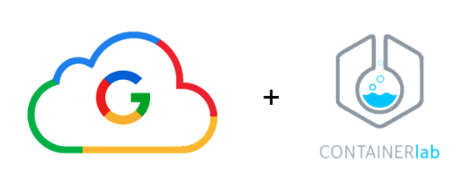
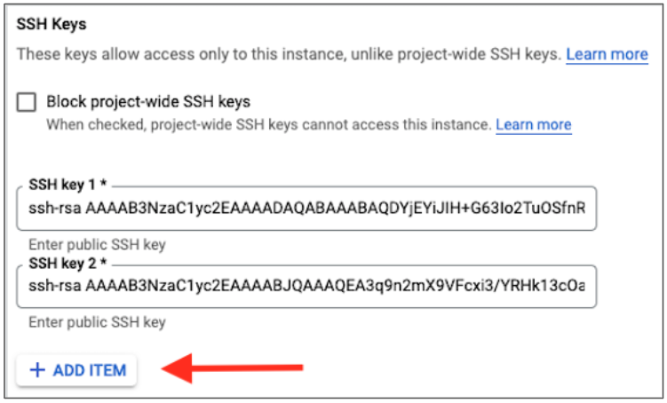

# Getting Started with GCP and ContainerLab



This repository outlines the steps needed to create a VM running in GCP to run ContainerLab.  Details on how to create your GCP Free Account can be found [here](https://cloud.google.com/).
## Step 1: Create GCP Account

Details on how to create your GCP Free Account can be found [here](https://cloud.google.com/).
Free $300 Credit to use.  No autocharge after free trial ends.

Typical VM Usage Fee is:  $0.25/hr (8 vCPUs 32GM RAM)

Disk and Public Static IP Address - additional cost (but minimal)

## Step 2: Create VM Instance with SSH Keys

From GCP [Console](https://console.cloud.google.com/), go to the Compute Engine section.  If this is your first time creating a VM instance in GCP, you will need to enable Compute Engine API.  This takes a few seconds to complete.  Once complete, you will be able to add a new VM Instance by clicking `CREATE INSTANCE`.  Use the follow instance attributes to create a VM capable of sufficiently running several cEOS instances for your ContainerLab environiment.
### 2.1 - Create VM Instance with the following attributes:

- `Name:` < hostname given to VM >
- `Region:` < your choice >
- `Zone:` < your choice >
- `Machine Series:` E2
- `Machine type:` e2-standard-8 (8vCPUs and 32GB RAM)
- `Boot Disk:`
  - `Operating System:` Ubuntu
  - `Version:` 20.04 LTS
  - `Boot disk type:` Balanced persistent disk
  - `Size (GB):` 20

Now click `CREATE` at the bottom.
### 2.2 Add SSH Keys

After Instance boots, add your Public SSH Key to the VM Instance.  In GCP, edit your VM instance and scroll down to the `Security and Access` section.  Click `ADD ITEM` to add your ssh key.  Then click `SAVE` at the bottom.



- Mac:  
  - Use existing keys or generate a new key pair with ssh-keygen
  - Add Public Key to Host
  - Connect to Host using favorite SSH client

- Windows (Putty):
  - Use Puttygen to create Key Pair
  - Add Public Key to the Host
  - Connect to Host via Putty using Private Key
### 2.3 - Connect to VM.  

Now SSH to VM instance using the assigned public IP address.  Note you can make this a static address if desired.

## Step 3: Install Docker
Below is a simplified one liner bash script that will install docker to your Linux VM.

```bash
bash -c "$(curl http://www.packetanglers.com/installdocker.sh)"
```

Logout and log back in to enable sudo permissions to Docker.

## Step 4: Download cEOS Image and import into Docker 
The following 2 commands will download an Arista cEOS Container image file and then import it into Docker.

```bash
curl http://www.packetanglers.com/images/cEOS-lab-4.27.3F.tar -o cEOS-lab-4.27.3F.tar
```

Now import this image into Docker - takes approximately 30 secs.  Be patient.

```bash
docker import cEOS-lab-4.27.3F.tar ceos:4.27.3F
```
## Step 5: Install ContainerLab

This is a one line install script. It will detect the OS

```bash
bash -c "$(curl -sL https://get-clab.srlinux.dev)"
```

## Step 6: Clone ContainerLab Topology Repo

```bash
git clone https://github.com/PacketAnglers/containerlab.git
```

## Step 7: Start ContainerLab

```bash
sudo clab deploy -t containerlab/topologies/topo1/topo1.yaml --reconfigure
```

## Step 8: Connect to your ContainerLab
Point your browser to the the public IP of your VM at this URL:

http://< VM public ip >/graphite

## Step 9: Destory Lab

```bash
sudo clab destroy -t containerlab/topologies/topo1/topo1.yaml
```

## Step 10: Shutdown VM

From GCP Console, make sure you shutdown your VM when you are not using it.