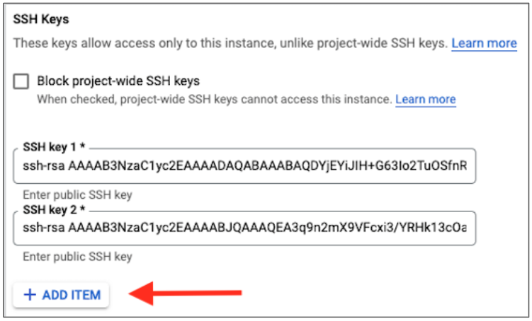

# ContainerLab using GCP

This repositiory outlines the steps needed to create a GCP Account to create a VM to run ContainerLab.
## Step 1: Create GCP Account

[https://console.cloud.google.com/](https://console.cloud.google.com/)

Free $300 Credit to use.  No autocharge after free trial ends.

Typical VM Usage Fee is:  $0.25/hr (8 vCPUs 32GM RAM)

Disk and Public Static IP Address - additional cost (but minimal)

## Step 2: Create Project and VM Instance with SSH Keys
Create a New [Project](https://cloud.google.com/resource-manager/docs/creating-managing-projects) to track your VMs under.

Create VM Instance with the following attributes:

- Machine type:	e2-standard-8 (8vCPUs and 32GB RAM)
- Disk: 20GB
- OS: Ubuntu 20.04


**SSH Keys**

After Instance boots, then add your Public SSH Key to the VM Instance.  In GCP, edit your VM instance and scroll down to the "Security and access" section.  Click `ADD ITEM` to add your ssh key.  Then click `SAVE` at the bottom.



- Mac:  
  - Use existing keys or generate a new key pair with ssh-keygen
  - Add Public Key to Host
  - Connect to Host using favorite SSH client

- Windows (Putty):
  - Use Puttygen to create Key Pair
  - Add Public Key to the Host
  - Connect to Host via Putty using Private Key

Now SSH to VM instance using the assigned public IP address.  Note you can make this a static address if desired.

## Step 3: Install Docker
Below is a simplified one liner bash script that will install docker to your Linux VM.

```bash
bash -c "$(curl http://www.packetanglers.com/installdocker.sh)"
```

Logout and log back in to enable sudo permissions to Docker.

## Step 4: Download cEOS Image and import into Docker 
The following 2 commands will download an Arista cEOS Container image file and then import it into Docker.

```bash
curl http://www.packetanglers.com/images/cEOS-lab-4.27.3F.tar -o cEOS-lab-4.27.3F.tar
```

Now import this image into Docker - takes approximately 30 secs.  Be patient.

```bash
docker import cEOS-lab-4.27.3F.tar ceos:4.27.3F
```
## Step 5: Install ContainerLab

This is a one line install script. It will detect the OS

```bash
bash -c "$(curl -sL https://get-clab.srlinux.dev)"
```

## Step 6: Clone Example ContainerLab Topology Repo

```bash
git clone https://github.com/PacketAnglers/clab-topos.git
```

## Step 7: Start first ContainerLab

```bash
sudo clab deploy -t clab-topos/atd-dc/atd-dc.yml --reconfigure
```
